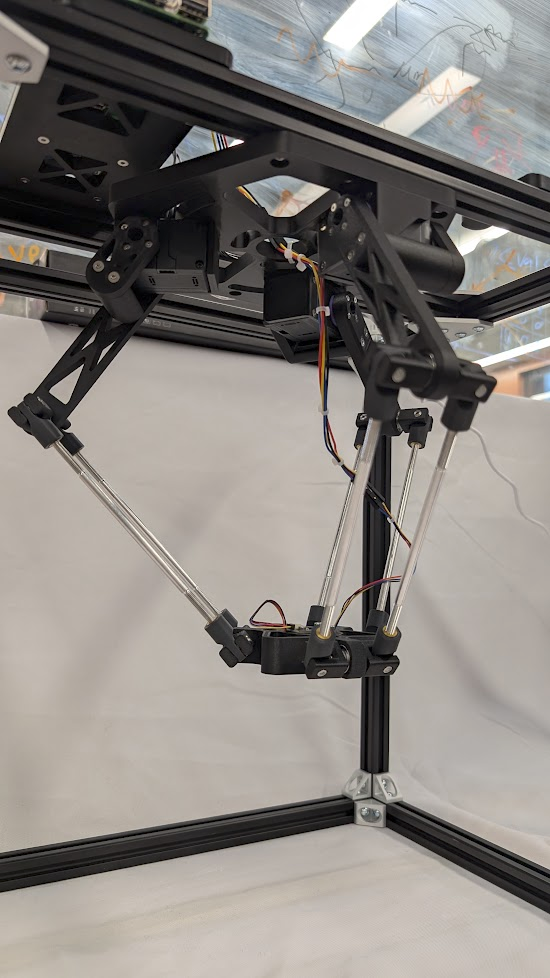

# DeltaRobot
Author: Sharwin Patil *(2025 MSR Winter Project)*

  
  

_Check out [my portfolio post](https://www.sharwinpatil.info/posts/delta-robot/) for more media and information._

# ROS Package Structure

## `delta_robot` Package
Contains main delta robot nodes that handle: kinematics, motor control, trajectory generation, and motion planning.

## `deltarobot_interfaces` Package
Contains all custom ROS messages and service used by the nodes in `delta_robot`.

## `delta_robot_sensors` Package
An external package for the sensors that were used on the original delta robot including a 9-DoF IMU and a Time-of-Flight range sensor.